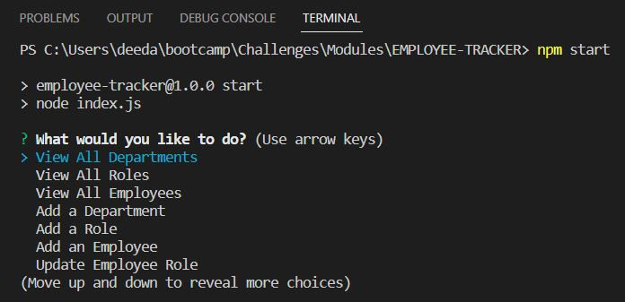
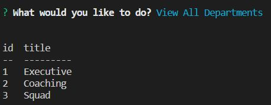
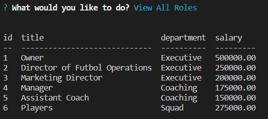
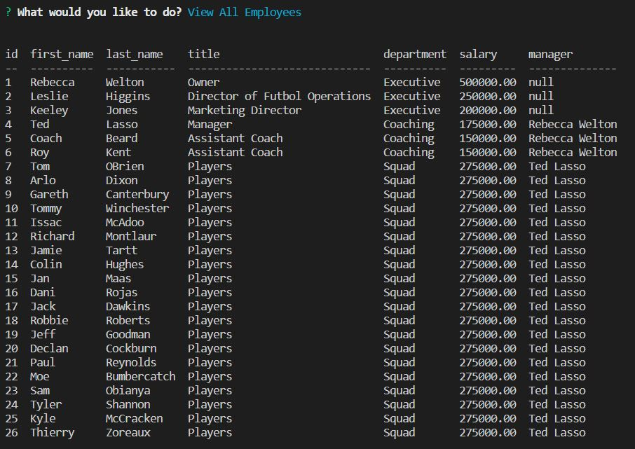
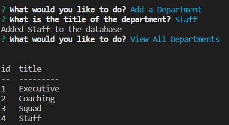
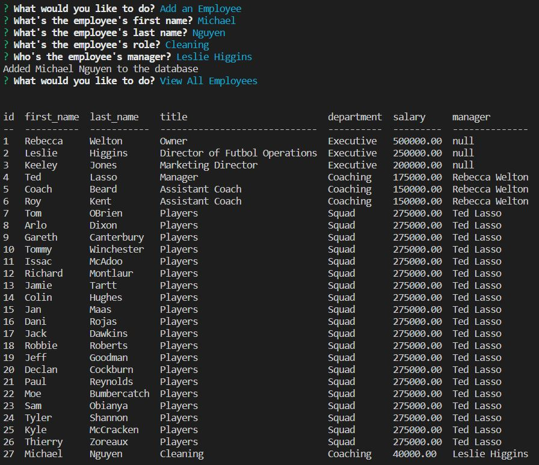
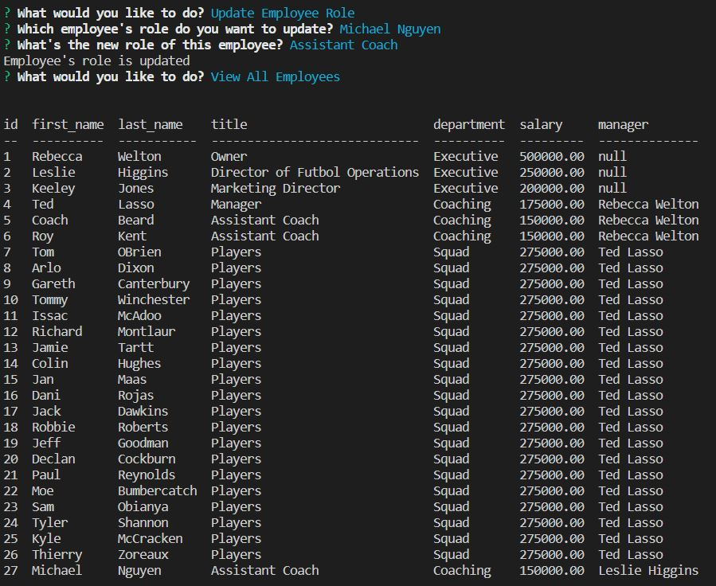

# EMPLOYEE-TRACKER

## URL
N/A

## Description

This project is creates a SQL database for a business owner to view and manage departments to be able to organize and plan their business.
The user is prompted with the following options: 
View all departments: Table with department names & ids
View all roles: Table with job title, role id, department that role belongs to, & salary
View all employees: Table with employee id, first names, last names, job titles, departments, salaries, & managers that employee reports to
Add a department: Create new department & add to database
Add a role: Create new role & add to database
Add an employee: Create new employee & add to database
Update an employee role: Update employee role & update in database

## Summary

```
GIVEN a command-line application that accepts user input
WHEN I start the application
THEN I am presented with the following options: view all departments, view all roles, view all employees, add a department, add a role, add an employee, and update an employee role
WHEN I choose to view all departments
THEN I am presented with a formatted table showing department names and department ids
WHEN I choose to view all roles
THEN I am presented with the job title, role id, the department that role belongs to, and the salary for that role
WHEN I choose to view all employees
THEN I am presented with a formatted table showing employee data, including employee ids, first names, last names, job titles, departments, salaries, and managers that the employees report to
WHEN I choose to add a department
THEN I am prompted to enter the name of the department and that department is added to the database
WHEN I choose to add a role
THEN I am prompted to enter the name, salary, and department for the role and that role is added to the database
WHEN I choose to add an employee
THEN I am prompted to enter the employee’s first name, last name, role, and manager, and that employee is added to the database
WHEN I choose to update an employee role
THEN I am prompted to select an employee to update and their new role and this information is updated in the database 
```

## Installation

npm init
npm i inquirer@8.2.4
npm install mysql2
npm install console-table

mysql -u root -p
source db/schema.sql
source db/seeds.sql
npm start

## Usage

This is a file that allows a business owner to view and manage departments to be able to organize and plan their business.

[EMPLOYEE-TRACKER-Walk-Through](https://user-images.githubusercontent.com/118239578/227795373-e9a2226f-c28a-4f2a-8a34-284556c35bfb.mp4)
















## Credits

N/A

## License

Please refer to the LICENSE in the repo.
